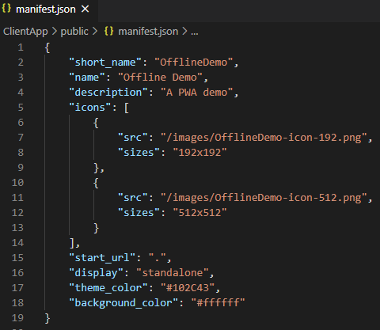
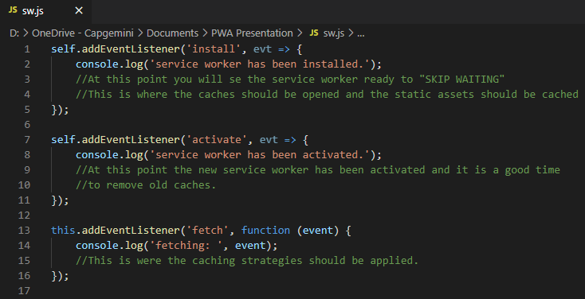

# How to create a Progressive Web App (PWA)

This is a documentation of the minimum required steps to use in order to get an installable PWA. The starting point is the project you get when creating new `ASP.NET Core Web Application in Visual Studio`. I have chosen React for this demo.

In addition to the criteria mentioned below, a web app also must be served over a secure network (HTTPS).

## Manifest

The manifest is a JSON file that lets the browser know how your PWA should behave when installed.
These things have to be in place:

- short_name or name
- icons (192px and 512px are required for Chrome)
- start_url
- display (must be `fullscreen`, `standalone` or `minimal-ui`)

Example of a sufficient manifest file:

## Service Worker

A service worker is a script that allows intercepting and control of how a web browser handles its network requests and asset caching.

This is the bare minimum that needs to be in place so the browser will interpret the wep app as a PWA:

## Sources

<https://developer.mozilla.org/en-US/docs/Web/Progressive_web_apps>
